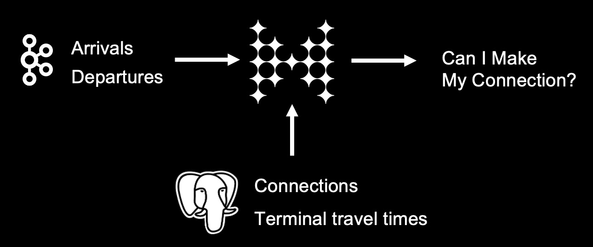

// Describe the title of your article by replacing 'Tutorial template' with the page name you want to publish.
= Airline Connections Demo/Tutorial
// Add required variables
:page-layout: tutorial
:page-product: cloud
:page-categories: sql, java, streaming 
:page-lang: sql, java 
:page-enterprise: 
:page-est-time: 20 mins 
:description: This tutorial provides detailed information and instruction for the Airline Connections demo built in to Viridian Trial.  

{description}


== Context

This demo/tutorial creates an application that uses streaming data about flight arrival and departure times, and correlates it with stored data about connecting flights, airport gates, and gate-to-gate travel times to determine whether there's enough time to make a particular flight connection. 



Specifically, you will learn how to
* Connect to external data sources and sinks
* Use SQL to search and display streaming data
* Use SQL import data from an external database
* Configure late event handling for streaming data
* Join streaming and stored data to generate continually-updated results

When you launch the demo in Viridian, you may see a step-by-step guide appear in conjunction with the demo. This tutorial is designed to supplement that guide, providing additional context and detail as well as links to reference materials. 

== Before you Begin

Before starting this tutorial, make sure that you meet the following prerequisites:

* You have a running cluster in Viridian Trial
* You've downloaded and connected the Command Line Client to your cluster
* For the client, you will need Java 11 or greater
* (Optional) Java IDE to view client code

== Step 1. Review What's Already Set Up

Begin by selecting the Airline Connections demo from the Viridian dashboard. This launches a pre-set configuration and opens the SQL browser window.

The pre-set configuration includes the following elements:

* Connections to a Kafka server and a Postgres database
* Mappings for streaming data
* Mappings for IMaps to hold contextual data
* Data imported from Postgres to local IMaps

The best way to build connections to external sources is to use the Connection Wizard. The wizard walks you through the steps of connecting to the external data source, then setting up the mapping so that the external data is available to the Hazelcast SQL engine

image:../images/connectwiz.gif[Walkthrough of Connection Wizard]

The SQL code for each element is below.

Mappings for streaming data:
```sql
CREATE OR REPLACE MAPPING "arrivals"
--topic name from Kafka
EXTERNAL NAME "viridiantrial.flights.arrivals" (
    --fields in topic
  event_time timestamp with time zone,
  "day" date,
  flight varchar,
  airport varchar,
  arrival_gate varchar,
  arrival_time timestamp 
)
DATA CONNECTION "ViridianTrialKafka"
OPTIONS (
    'keyFormat' = 'varchar',
    'valueFormat' = 'json-flat'
);
```
```sql
CREATE OR REPLACE MAPPING "departures"
--topic name in Kafka
EXTERNAL NAME "viridiantrial.flights.departures" (
    --fields in topic
  event_time timestamp with time zone,
  "day" date,
  flight varchar,
  airport varchar,
  departure_gate varchar,
  departure_time timestamp
)
DATA CONNECTION "ViridianTrialKafka"
OPTIONS (
    'keyFormat' = 'varchar',
    'valueFormat' = 'json-flat'
);
```
Mappings for data in Postgres:
```sql
CREATE OR REPLACE MAPPING "connections"
--name of data store in Postgres
EXTERNAL NAME "public"."connections" (
  arriving_flight varchar,
  departing_flight varchar
)
DATA CONNECTION "ViridianTrialPostgres";
```
```sql
CREATE OR REPLACE MAPPING "minimum_connection_times"
EXTERNAL NAME "public"."minimum_connection_times" (
  airport varchar,
  arrival_terminal varchar,
  departure_terminal varchar,
  minutes integer
)
DATA CONNECTION "ViridianTrialPostgres";
```
Local storage for data from Postgres:
```sql
CREATE OR REPLACE MAPPING local_mct(
  airport varchar,
  arrival_terminal varchar,
  departure_terminal varchar,
  minutes integer
)
Type IMap 
OPTIONS (
    'keyFormat' = 'varchar',
  'valueFormat' = 'json-flat'
);
```
```sql
CREATE OR REPLACE MAPPING local_connections(
  arriving_flight varchar,
  departing_flight varchar
)
Type IMap 
OPTIONS (
    'keyFormat' = 'varchar',
  'valueFormat' = 'json-flat'
);
```
Import Postgres data into local storage:
```sql
--In order to ensure a clean write, we make sure the map is empty
DELETE FROM local_mct;
--now we copy all the data from the external store
INSERT INTO local_mct(__key, airport, arrival_terminal, departure_terminal, minutes) 
SELECT airport||arrival_terminal||departure_terminal, airport, arrival_terminal, departure_terminal, minutes 
FROM minimum_connection_times;
```
```sql
DELETE FROM local_connections;
INSERT INTO local_connections(__key, arriving_flight, departing_flight) 
SELECT arriving_flight || departing_flight, arriving_flight, departing_flight FROM "connections";
```
[NOTE]
====
Why are we copying the Postgres data into local storage? We are using the data to enrich real-time streaming data. Having the data co-located means there's no read delay in accessing the enriching data.
====

IMap to store output of JOIN job:
```sql
CREATE OR REPLACE MAPPING live_connections(
  arriving_flight varchar,
  arrival_gate varchar,
  arrival_time timestamp,
  departing_flight varchar,
  departure_gate varchar,
  departure_time timestamp,
  connection_minutes integer,
  mct integer,
  connection_status varchar
)
Type IMap 
OPTIONS (
    'keyFormat' = 'varchar',
  'valueFormat' = 'json-flat'
);
```
== Step 2. Build and Test JOIN
Now that the storage framework and streaming maps are set up, now we can look at the actual data streams.

. Examine the data in the `arrivals` and `departures` streams.
+
```sql
SELECT * FROM arrivals;
```
+
```sql
SELECT * FROM departures;
```
. When you are dealing with streaming data, you need to accommodate the possibility that data will arrive late or not at all. You do not want these late or missing events to slow down your jobs. In order to prevent this, you will use an IMPOSE_ORDER statement to define a threshold (lag) for how late events can be before they are ignored. 
+
Because you will be using this ordered data in a subsequent JOIN statement, you need to create a view that holds the ordered data. In this demo, both the arrivals and departures data needs to be ordered. The departures data is already done, so run this code to impose order on the arrivals data.
+
```sql
CREATE OR REPLACE VIEW arrivals_ordered AS
SELECT * FROM TABLE (
  IMPOSE_ORDER(
     TABLE arrivals, 
     DESCRIPTOR(event_time),  
     INTERVAL '1' HOUR
  )
);
```
[#CLC_setup]
== Step 3. Command Line Client setup
If you have not already set up the Command Line Client (CLC), you need to do so now. If you already have it set up, skip to xref:Submit-Job[Step 4. Submit Job].

. Click on the Dashboard icon on the left of your screen.

. Select the CLI icon.

. Follow the steps 

== Step 4. Submit Job


== Step 4. Download and Run Client


== Summary

////
Summarise what knowledge the reader has gained by completing the tutorial, including a summary of each step's goals (this is a good way to validate whether your tutorial has covered all you need it to.)
////


== See Also

// Optionally, add some links to resources, such as other related guides.
